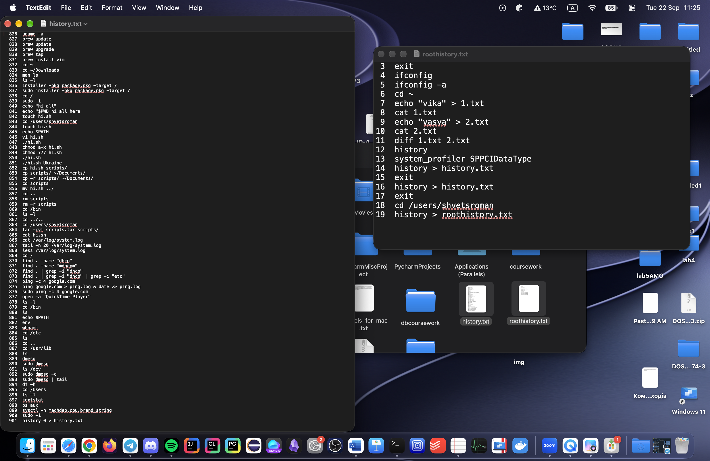
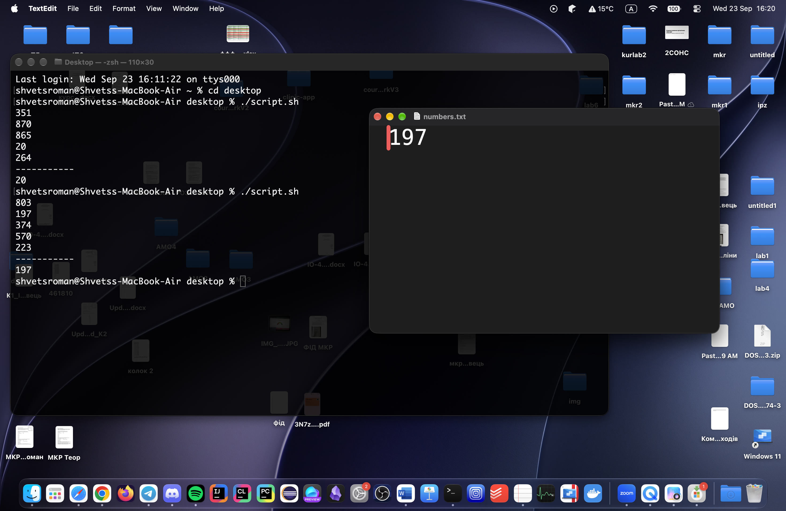

# Лабораторна робота 1
## Завдання 1.1
#### Команди зі звичайного користувача:
```sh
  826  uname -a
  827  brew update
  828  brew update
  829  brew upgrade
  830  brew tap
  831  brew install vim
  832  cd ~
  833  cd ~/Downloads
  834  man ls
  835  ls -l
  836  installer -pkg package.pkg -target /
  837  sudo installer -pkg package.pkg -target /
  838  cd /
  839  sudo -i
  840  echo "hi all"
  841  echo "$PWD hi all here
  842  touch hi.sh
  843  cd /users/shvetsroman
  844  touch hi.sh
  845  echo $PATH
  846  vi hi.sh
  847  ./hi.sh
  848  chmod a+x hi.sh
  849  chmod 777 hi.sh
  850  ./hi.sh
  851  ./hi.sh Ukraine
  852  cp hi.sh scripts/
  853  cp scripts/ ~/Documents/
  854  cp -r scripts/ ~/Documents/
  855  cd scripts
  856  mv hi.sh ../
  857  cd ..
  858  rm scripts
  859  rm -r scripts
  860  cd /bin
  861  ls -l
  862  cd ../..
  863  cd /users/shvetsroman
  864  tar -cvf scripts.tar scripts/
  865  cat hi.sh
  866  cat /var/log/system.log
  867  tail -n 20 /var/log/system.log
  868  less /var/log/system.log
  869  cd /
  870  find . -name "dhcp"
  871  find . -name "*dhcp*"
  872  find . | grep -i "dhcp"
  873  find . | grep -i "dhcp" | grep -i "etc"
  874  ping -c 4 google.com
  875  ping google.com > ping.log & date >> ping.log
  876  sudo ping -c 4 google.com
  877  open -a "QuickTime Player"
  878  ls -l
  879  cd /bin
  880  ls
  881  echo $PATH
  882  env
  883  whoami
  884  cd /etc
  885  ls
  886  cd ..
  887  cd /usr/lib
  888  ls
  889  dmesg
  890  sudo dmesg
  891  ls /dev
  892  sudo dmesg -c
  893  sudo dmesg | tail
  894  df -h
  895  cd /Users
  896  ls -l
  897  kextstat
  898  ps aux
  899  sysctl -n machdep.cpu.brand_string
  900  sudo -i
  901  history 0 > history.txt
```
#### Команди з root-користувача:
```sh
    3  exit
    4  ifconfig
    5  ifconfig -a
    6  cd ~
    7  echo "vika" > 1.txt
    8  cat 1.txt
    9  echo "vasya" > 2.txt
   10  cat 2.txt
   11  diff 1.txt 2.txt
   12  history
   13  system_profiler SPPCIDataType
   14  history > history.txt
   15  exit
   16  history > history.txt
   17  exit
   18  cd /users/shvetsroman
   19  history > roothistory.txt
```
> У лабораторній роботі було використано не GNU/Linux, а MacOS, тому команди можуть відрізнятись від звичайних, а також історія поділена на дві частини, залежно від користувача.



## Завдання 1.2
#### Код скрипту:
```sh
#!/bin/bash
FILE="numbers.txt"
> "$FILE"
for i in {1..5}; do
num=$(( RANDOM % 1000 + 1 ))
echo "$num" >> "$FILE"
done
cat "$FILE"
echo "-----------"
min_num=$(sort -n "$FILE" | head -n 1)
echo "$min_num" > "$FILE"
cat "$FILE"
```
> **Алгоритм даного скрипта:**
> 1. Позначення змінної зі шляхом до файлу
> 2. Очистка файлу (на випадок повторного використання)
> 3. Цикл з алгоритмом генерації пʼяти псевдовипадкових чисел та послідовним записом їх у файл
> 4. Читання файлу для виводу на екран
> 5. Вивід на екран роздільної лінії між числами та мінімальним значенням
> 6. Пошук мінімального значення
> 7. Запис мінімального значення у файл з попередньою очисткою його змісту
> 8. Читання файлу для виводу на екран


